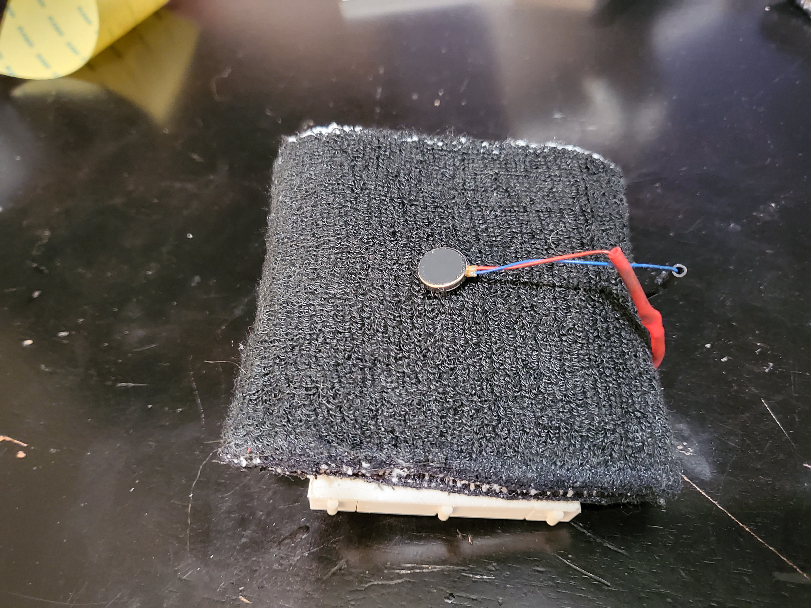

# CT-B-GONE

## Parts list:
- HiLetsGo ESP32 (OG) / TinyPICO (Air)
- MPU 6050 accelerometer/gyro/thermometer
- Vibration motor
- (2) wristbands
- Misc electronics

## UPDATE

###The CT-B-GONE Air is the smaller and more portable sequel to the CT-B-GONE.

What makes the "Air" better:

-Uses a TinyPOCO (very small ESP32 with built-in battery charging) instead of a generic ESP32
-Uses a protoboard instead of a breadboard

## How to build:

### Step 1: Make the circuit as shown on [Circuito.io](https://www.circuito.io/app?components=513,8449,11028,360217)

When complete, it'll look something like this, (but hopefully less messy):

### Step 2: Fix the breadboard to the first wristband

My breadboard came with an adhesive strip on the bottom, but you can get creative if need be.

### Step 3: Fix the vibration motor to the opposite side of the wristband

The vibration motor has an adhesive strip on its backside, but you should also sew it in place for greater security.

I tried my best, and that's what matters :D

### Step 4: Slip the second wristband over everything

It should look like this:

